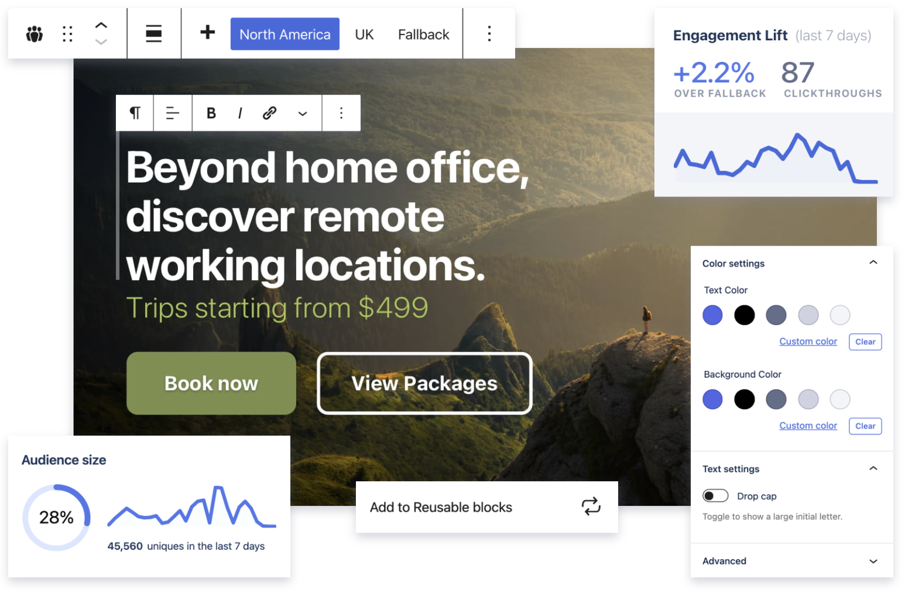

# Experience Blocks

Altis [Experience Blocks](https://www.altis-dxp.com/experience-blocks/) (XBs) are built-in blocks for the editor that provide advanced capabilities. We are continually extending the range and uses of these blocks.

The blocks themselves are powered by the [Optimization Framework](./optimization-framework/README.md) and [Native Analytics](./native/README.md) features including [audiences](./native/audiences.md). This enables you to measure the performance of and personalize specific pieces of content on your pages, whether in the content, sidebars or anywhere on your site that supports the block editor.
