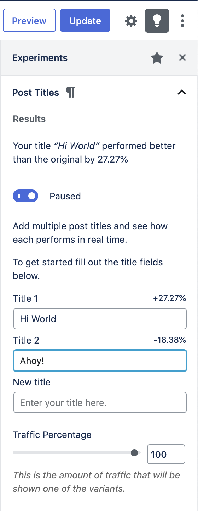

# Experiments

Backed by [native Altis Analytics](./native.md) Experiments are a powerful tool for optimizing content and measuring the effectiveness of changes to the site.

The feature is enabled by default and provides a developer API for creating custom experiments as well as some built in features.

## Features

- Tests run until the end date or when a statistically significant improvement has been found
- When a winner is found the winning variant will be shown to everyone

The following built in experiments are provided:

### Post Title A/B Tests

With this feature enabled it's simple to create AB Tests for your post titles directly from the post edit screen.

It is enabled by default but can be disabled via the configuration file:

```json
{
	"extra": {
		"altis": {
			"modules": {
				"analytics": {
					"native": {
						"experiments": {
							"titles": false
						}
					}
				}
			}
		}
	}
}
```

Within the post edit screen click on the lightbulb icon to access the Experiments panel. Here you can set the alternative titles, the amount of traffic to show the tests to as well as start and end dates.

Once you are ready to run the test click on the toggle to unpause it. Results are updated every hour until a statistically significant winner is found.



By default post title AB tests are enabled for Posts and Pages however custom post types can be supported using the `altis.experiments.titles` key either when registering the post type or in the `init` action, for example:

```php
add_action( 'init', function () {
	add_post_type_support( 'events', 'altis.experiments.titles' );
} );
```

## Creating Custom Tests

There is a programmatic API to register AB tests for posts:

**`register_post_ab_test( string $test_id, array $options )`**

Sets up the test.

- `$test_id`: A unique ID for the test.
- `$options`: Configuration options for the test.
  - `label <string>`: A human readable label for the test.
  - `rest_api_variants_field <string>`: The field name to make variants available at.
  - `rest_api_variants_type <string>`:  The data type of the variants.
  - `goal <string>`: The conversion goal event name, eg "click" or "click:.selector a".
  - `goal_filter <string | callable>`: Elasticsearch bool query to filter goal results. If a callable is passed it receives the test ID and post ID as arguments.
  - `query_filter <string | callable>`: Elasticsearch bool query to filter total events being queried. If a callable is passed it receives the test ID and post ID as arguments.
  - `variant_callback <callable>`: An optional callback used to render variants based. Arguments:
    - `$value <mixed>`: The variant value.
    - `$post_id <int>`: The post ID.
    - `$args <array>`: Optional args passed to `output_ab_test_html_for_post()`.
  - `winner_callback <callable>`: An optional callback used to perform updates to the post when a winner is found. Defaults to no-op. Arguments:
    - `$post_id <int>`: The post ID
    - `$value <mixed>`: The winning variant value.
  - `post_types <array>`: An array of supported post types for the test.

**`output_ab_test_html_for_post( string $test_id, int $post_id, string $default_content, array $args = [] )`**

Returns the AB Test markup for client side processing.

- `$test_id`: A unique ID for the test.
- `$post_id`: The post ID for the test.
- `$default_content`: The default content for the control test.
- `$args`: An optional array of data to pass through to `variant_callback`.

```php
namespace Altis\Experiments;

// Register the test.
register_post_ab_test( 'featured_images', [
	'rest_api_variants_type' => 'integer',
	'goal' => 'click',
	'variant_callback' => function ( $attachment_id, $post_id, $args ) {
		return wp_get_attachment_image(
			$attachment_id,
			$args['size'],
			false,
			$args['attr']
		);
	}
] );

// Apply the test by filtering some standard output.
add_filter( 'post_thumbnail_html', function ( $html, $post_id, $post_thumbnail_id, $size, $attr ) {
	return output_ab_test_html_for_post( 'featured_images', $post_id, $html, [
		'size' => $size,
		'attr' => $attr,
	] );
}, 10, 5 );
```

### Goal Tracking

Conversion goals are how it is determined whether a variant has been successful or not. This is calculated as the `number of conversions / number of impressions`.

The `click` goal handler is provided out of the box and adds a click event handler to the nearest `<a>` tag.

#### Scoped Event Handling

For tests where more complex alternative HTML is being rendered you can define the event target with a CSS selector.

For example setting the goal to `click:.my-target` will track a conversion when the element in the variant HTML matching `.my-target` is clicked. This applies for all registered goal handlers.

#### Custom Goal Handlers

You can define your own goal handlers in JavaScript:

**`Altis.Analytics.Experiments.registerGoal( name <string>, callback <function>, closest <array> )`**

This function adds a goal handler where `name` corresponds to the value of `$options['goal']` when registering an AB Test.

The callback receives the following parameters:

- `element <HTMLElement>`: Target node for the event.
- `record <function>`: Receives the target element and a callback to log the conversion. The function accepts two optional arguments:
  - `attributes <object>`: Custom attributes to record with the event.
  - `metrics <object>`: Custom metrics to record with the event.

The `closest` parameter allows you to ensure the element passed to your callback is of a certain type, achieved by stepping up through the DOM tree, for example to return only anchor tags you would pass `[ 'a' ]`.

```js
Altis.Analytics.Experiments.registerGoal( 'scrollIntoView', function ( element, record ) {
	var listener = function () {
		// Check element has come into view or not.
		if ( element.getBoundingClientRect().top > window.innerHeight ) {
			return;
		}

		// Remove event listener immediately.
		window.removeEventListener( 'scroll', listener );

		// Record event.
		record();
	};

	// Start listening to scroll events.
	window.addEventListener( 'scroll', listener );
} );
```

**Note:** This JavaScript should be enqueued in the `<head>` via the `wp_enqueue_scripts` action.

### Variant Data Storage

How you manage the variant data is up to you, for example you could use Fieldmanager, CMB2 or other custom meta boxes framework to save the variant data.

Note you should use the following functions to get and update the variants:

**`get_ab_test_variants_for_post( string $test_id, int $post_id ) : array`**

**`update_ab_test_variants_for_post( string $test_id, int $post_id, array $variants )`**

### Actions

**`altis.experiments.test.ended: (string) $test_id, (int) $post_id`**

Fired when a test has ended either by finding a statistically significant difference or the end date was reached.

**`altis.experiments.test.ended.$test_id: (int) $post_id`**

This is the same as above but scoped to tests with the ID `$test_id`.

**`altis.experiments.test.winner_found: (string) $test_id, (int) $post_id, (mixed) $value`**

Fired when a winning variant has been found. The `$value` parameter is the stored variant value.

**`altis.experiments.test.winner_found.$test_id: (int) $post_id, (mixed) $value`**

This is the same as the above but scoped to tests with the ID `$test_id`.

## Testing Experiments

In order to see your experiments working locally you need to generate enough traffic to get statistically significant results. You can direct traffic to your development environment using the [Trafficator](https://github.com/humanmade/trafficator) tool.

Install it by running `npm install -g trafficator`.

Create a file called `.trafficator.js` that will perform the necessary actions to trigger conversions. The following example tests the built in `titles` experiment by doing the following:

- generate visits to the home page of your local site
- check the stored tests value, for post ID 1 this is `titles_1`
- return different probabilities for different variant IDs
- click the title link if the probability is met

```js
module.exports = {
	funnels: [
		{
			entry: 'https://my-project.altis.dev/',
			steps: [
				{
					name: 'Click Article Title',
					probability: async page => {
						const p = await page.evaluate(() => {
							const tests = JSON.parse(localStorage.getItem('_altis_ab_tests') || "{}");
							if (tests.titles_1) {
								if (tests.titles_1 === 1) {
									return 0.4;
								}
								if (tests.titles_1 === 2) {
									return 0.1;
								}
							}
							return 0.15;
						});
						return p;
					},
					action: async page => {
						await page.click('.post-1 .entry-title a');
					}
				}
			]
		}
	],
};
```

This should generate traffic that exhibits a trend towards the first title variant.
